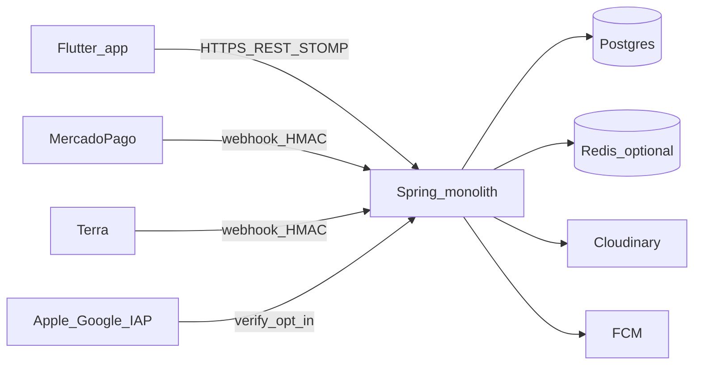

# 02 — Topologia

**Normativo.** Descreve o sistema **como está hoje**. Não inventar componentes ausentes.

## Diagrama

## Peças

| Peça | Papel | Não é |
|------|-------|-------|
| Flutter (`focux-app`) | UI Personal + Aluno; nunca SSOT de authZ | Backend |
| Spring Boot monolítico | Domínios em packages; um deploy Railway | Microsserviços |
| PostgreSQL + Flyway | SSOT de dados; multi-tenant por coluna | Sharded cluster |
| Caffeine | Cache BFF in-process (`/home`, Aluno 360) | CDN |
| Redis | Opcional: STOMP cluster / invalidação | Obrigatório em single-node |
| Cloudinary | Mídia / MoveKit CDN | Object store genérico no app |
| ShedLock | Locks de `@Scheduled` | Fila Kafka |
| Webhooks MP/Terra/IAP | Ingress assíncrono fail-closed | Polling de plano |

## Regras

1. **Uma região, um serviço API** até gatilho em [10-evolucao](10-evolucao.md).
2. **Todo tenant passa por `TenantContext`** — personal e aluno no mesmo processo.
3. **Website** (`focux-website`) e landing no BE são superfícies públicas; contratos públicos não furam authZ do app.

## Onde no código

- API: `focux-backend` (`com.focux.modules.*`)
- App: `focux-app/lib`
- Jobs: `TrialExpirationJob`, `OutboxProcessorJob`, dunning cron
- Webhooks: `WebhookController`, Terra/IAP controllers

## Gate

- [ ] Feature nova não exige segundo serviço “porque o primer falou de microservices”.
- [ ] Diagrama do PR não adiciona fila/CDN/região sem gatilho de `10-evolucao`.
